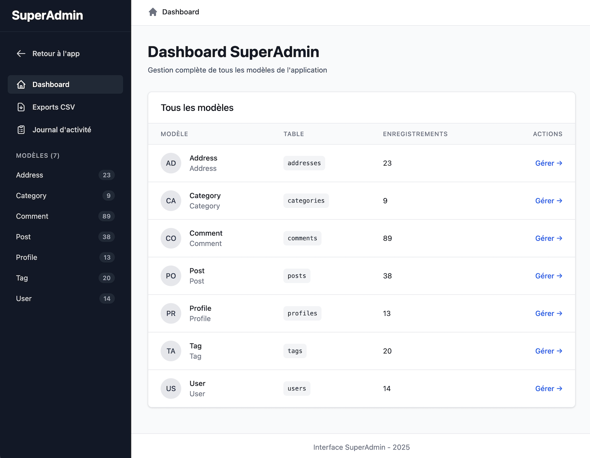

# SuperAdmin 🚀

[](https://badge.fury.io/rb/super_admin)
[](https://github.com/ThibautBaissac/super_admin/actions/workflows/ci.yml)
[](https://github.com/rubocop/rubocop)
[](LICENSE)

**A modern, flexible administration engine for Rails applications**

SuperAdmin is a mountable Rails engine that provides a full-featured administration interface inspired by Administrate and ActiveAdmin, built for modern Rails 7+ applications with Hotwire, Turbo, and Tailwind CSS.



**Quick Links:** [📖 Documentation](docs/) • [⚡ Features](docs/FEATURES.md) • [🚀 Quick Start](#quick-start) • [🤝 Contributing](#contributing)

---

## Why SuperAdmin?

- **Built for Rails 7+** - Takes full advantage of Hotwire, Turbo, and modern Rails features
- **⚡ Fast by Default** - Turbo-powered interactions without writing JavaScript
- **Beautiful UI** - Modern, responsive design with Tailwind CSS
- **Easy to Customize** - Simple DSL that doesn't get in your way
- **Batteries Included** - Audit logging, CSV exports, and authorization built-in
- **Quick Setup** - Get a full admin panel running in under 5 minutes

## Status

> **In Active Development** - This gem is currently in active development. APIs may change between versions. Production use is not recommended until v1.0 release.

## Requirements

- **Ruby** >= 3.2
- **Rails** >= 7.1
- **ImportMap Rails** (default in Rails 8+)

## Installation

### 1. Add the Gem

```ruby
gem "super_admin", git: "https://github.com/ThibautBaissac/super_admin.git"
```

Then run:
```bash
bundle install
```

### 2. Install SuperAdmin

```bash
rails generate super_admin:install
rails db:migrate
```

### 3. Mount the Engine

Add to your `config/routes.rb`:

```ruby
mount SuperAdmin::Engine => '/super_admin'
```

### 4. Generate Dashboards

```bash
# Generate dashboards for all models
rails generate super_admin:dashboard

# Or for a specific model
rails generate super_admin:dashboard User
```

### 5. Start Your Server

```bash
bin/dev
```

Visit `/super_admin` and you're done! 🎉

## Quick Start

### Customize a Dashboard

Edit the generated dashboard to control which attributes are displayed:

```ruby
# app/dashboards/super_admin/user_dashboard.rb
module SuperAdmin
  class UserDashboard < BaseDashboard
    # Attributes shown in the table view
    def collection_attributes
      %i[id email name created_at]
    end

    # Attributes shown in the detail view
    def show_attributes
      %i[id email name role created_at updated_at posts]
    end

    # Attributes shown in the form
    def form_attributes
      %i[email name role bio]
    end
  end
end
```

### Configure Authorization

In `config/initializers/super_admin.rb`:

```ruby
SuperAdmin.configure do |config|
  # Use Pundit
  config.authorization_adapter = :pundit

  # Or custom authorization
  config.authorize_with do
    redirect_to root_path unless current_user&.admin?
  end

  # Number of records per page
  config.records_per_page = 20

  # Maximum nested depth for associations
  config.max_nested_depth = 3
end
```

## Key Features

- **Full CRUD Operations** - Create, read, update, delete with minimal configuration
- **Advanced Filtering** - Search, filter, and sort with dynamic UI
- **CSV Exports** - Background job processing with status tracking
- **Audit Logging** - Track all admin activities automatically
- **Nested Associations** - Smart form builder with configurable depth
- **Authorization** - Pundit, CanCanCan, or custom authorization
- **Turbo Streams** - Real-time updates without page reloads
- **Accessibility** - WCAG 2.1 compliant with ARIA labels and keyboard navigation

[📖 See all features](docs/FEATURES.md)

## Documentation

- **[Features](docs/FEATURES.md)** - Complete feature list
- **[Architecture](CLAUDE.md)** - Technical architecture and patterns
- **[Contributing](CONTRIBUTING.md)** - How to contribute
- **[Code of Conduct](CODE_OF_CONDUCT.md)** - Community guidelines

## Development

### Setup

```bash
git clone https://github.com/ThibautBaissac/super_admin.git
cd super_admin
bundle install
```

### Running Tests

```bash
bin/rails test
```

### Code Quality

```bash
bin/rubocop
```

### Testing with a Rails App

```bash
cd test/dummy
bin/rails db:seed
bin/dev
# Visit http://localhost:3000/super_admin/
```

## Contributing

We welcome contributions! See [CONTRIBUTING.md](CONTRIBUTING.md) for guidelines.

1. Fork the repository
2. Create your feature branch (`git checkout -b feat/my-feature`)
3. Write tests for your changes
4. Run tests and linter (`bin/rails test && bin/rubocop`)
5. Commit your changes (`git commit -am 'Add new feature'`)
6. Push to the branch (`git push origin feat/my-feature`)
7. Create a Pull Request

## License

SuperAdmin is released under the [MIT License](MIT-LICENSE).

## Support

- 🐛 [Report a Bug](https://github.com/ThibautBaissac/super_admin/issues/new?labels=bug)
- 💡 [Request a Feature](https://github.com/ThibautBaissac/super_admin/issues/new?labels=enhancement)
- 📖 [Documentation](docs/)

## Acknowledgments

SuperAdmin is inspired by:
- [Administrate](https://github.com/thoughtbot/administrate) - Thoughtbot's admin framework
- [ActiveAdmin](https://github.com/activeadmin/activeadmin) - The Ruby on Rails framework for creating elegant backends

---

Made with ❤️ by [Thibaut Baissac](https://github.com/ThibautBaissac)

[⭐ Star this repo](https://github.com/ThibautBaissac/super_admin) • [🐛 Report an issue](https://github.com/ThibautBaissac/super_admin/issues)
